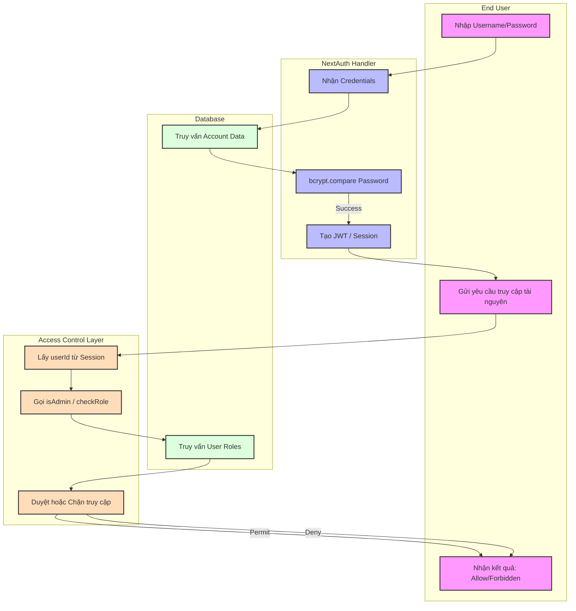

# Sơ đồ Luồng Authentication & RBAC (Swimlane Flowchart)

```mermaid
flowchart TD
    %% Define Subgraphs for Actors
    subgraph User ["End User"]
        direction TB
        U1[Nhập Username/Password]
        U2[Gửi yêu cầu truy cập tài nguyên]
        U3[Nhận kết quả: Allow/Forbidden]
    end

    subgraph NA ["NextAuth Handler"]
        direction TB
        N1[Nhận Credentials]
        N2[bcrypt.compare Password]
        N3[Tạo JWT / Session]
    end

    subgraph DB ["Database"]
        direction TB
        D1[Truy vấn Account Data]
        D2[Truy vấn User Roles]
    end

    subgraph ACL ["Access Control Layer"]
        direction TB
        A1[Lấy userId từ Session]
        A2[Gọi isAdmin / checkRole]
        A3[Duyệt hoặc Chặn truy cập]
    end

    %% Define Flow / Transitions
    %% Authentication Phase
    U1 --> N1
    N1 --> D1
    D1 --> N2
    N2 -- Success --> N3
    N3 --> U2

    %% Authorization Phase
    U2 --> A1
    A1 --> A2
    A2 --> D2
    D2 --> A3
    A3 -- Permit --> U3
    A3 -- Deny --> U3

    %% Styling
    classDef user fill:#f9f,stroke:#333,stroke-width:2px;
    classDef na fill:#bbf,stroke:#333,stroke-width:2px;
    classDef db fill:#dfd,stroke:#333,stroke-width:2px;
    classDef acl fill:#fdb,stroke:#333,stroke-width:2px;

    class U1,U2,U3 user;
    class N1,N2,N3 na;
    class D1,D2 db;
    class A1,A2,A3 acl;
```
