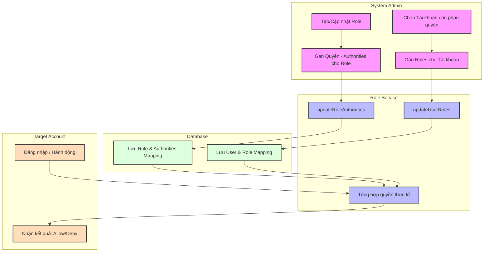

# Account Role Management Workflow Diagrams Implementation Plan

> **For agentic workers:** REQUIRED SUB-SKILL: Use superpowers:subagent-driven-development (recommended) or superpowers:executing-plans to implement this plan task-by-task. Steps use checkbox (`- [ ]`) syntax for tracking.

**Goal:** Create a Mermaid-based swimlane flowchart illustrating the process of Role Definition and User Role Assignment.

**Architecture:** Use Mermaid's `flowchart TD` syntax with `subgraph` blocks to represent four swimlanes (System Admin, Role Service, Database, Target Account). The flow transitions from role creation to user assignment and final permission enforcement.

**Tech Stack:** Mermaid.js, Markdown.

---

### Task 1: Implement Account Role Management Workflow Diagram

**Files:**
- Create: `docs/diagrams/account-role-management-workflow.md`

- [ ] **Step 1: Create the Mermaid diagram file**

Write the following content to `docs/diagrams/account-role-management-workflow.md`:

```markdown
# Sơ đồ Luồng Quản lý Phân quyền Tài khoản (Swimlane Flowchart)


```

- [ ] **Step 2: Verify file creation**

Run: `ls docs/diagrams/account-role-management-workflow.md`
Expected: File exists.

- [ ] **Step 3: Commit**

```bash
git add docs/diagrams/account-role-management-workflow.md
git commit -m "docs: add account role management workflow diagram"
```
