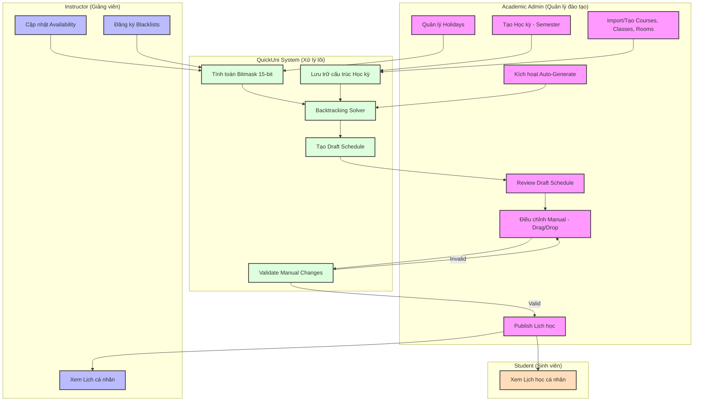

# Scheduling Workflow Diagrams Implementation Plan

> **For agentic workers:** REQUIRED SUB-SKILL: Use superpowers:subagent-driven-development (recommended) or superpowers:executing-plans to implement this plan task-by-task. Steps use checkbox (`- [ ]`) syntax for tracking.

**Goal:** Create a Mermaid-based swimlane flowchart illustrating the interactions between different Actors in the Scheduling system.

**Architecture:** Use Mermaid's `flowchart TD` syntax with `subgraph` blocks to represent four distinct swimlanes (Academic Admin, Instructor, QuickUni System, Student). Data flow is represented by directed edges connecting these swimlanes.

**Tech Stack:** Mermaid.js, Markdown.

---

### Task 1: Setup Diagrams Directory

**Files:**
- Create: `docs/diagrams/.gitkeep` (to ensure the directory exists and is tracked)

- [ ] **Step 1: Create the diagrams directory**

Run: `mkdir docs/diagrams`

- [ ] **Step 2: Add a .gitkeep file**

Run: `echo "" > docs/diagrams/.gitkeep`

- [ ] **Step 3: Commit**

```bash
git add docs/diagrams/.gitkeep
git commit -m "chore: setup docs/diagrams directory"
```

---

### Task 2: Implement Scheduling Workflow Diagram

**Files:**
- Create: `docs/diagrams/scheduling-actors-workflow.md`

- [ ] **Step 1: Create the Mermaid diagram file**

Write the following content to `docs/diagrams/scheduling-actors-workflow.md`:

```markdown
# Sơ đồ Luồng hệ thống Scheduling (Swimlane Flowchart)


```

- [ ] **Step 2: Verify file creation**

Run: `ls docs/diagrams/scheduling-actors-workflow.md`
Expected: File exists.

- [ ] **Step 3: Commit**

```bash
git add docs/diagrams/scheduling-actors-workflow.md
git commit -m "docs: add scheduling actors workflow diagram"
```
